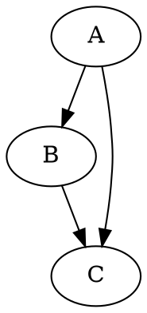
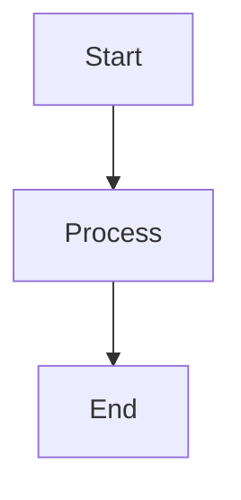

# 美しいアーキテクチャ図作成ワークフロー

## 概要

このプロジェクトでは、SVGコマンド生成システムを使用して美しいアーキテクチャ図を作成し、Quartoレポートに統合します。生成されたSVGファイルは必要に応じてInkscapeで手動編集できます。

## ディレクトリ構造

```
sources/diagrams/
├── plantuml/                    # PlantUMLソースファイル (.puml, .plantuml)
│   └── sample-architecture.puml # サンプルアーキテクチャ図
├── graphviz/                    # Graphvizソースファイル (.dot, .gv)
│   └── sample-network.dot       # サンプルネットワーク図
├── mermaid/                     # Mermaidソースファイル (.mmd, .mermaid)
│   └── sample-flow.mmd          # サンプルフロー図
└── generated/                   # 生成されたSVGファイル（自動生成）
    ├── sample-architecture.svg
    ├── sample-network.svg
    └── sample-flow.svg
```

## 基本的な使用方法

### 1. 図表生成コマンド

```bash
# 基本的な使用法
scripts/generate-diagrams.sh [type] [input] [output] [options]

# 例
scripts/generate-diagrams.sh plantuml architecture.puml
scripts/generate-diagrams.sh graphviz network.dot
scripts/generate-diagrams.sh mermaid flow.mmd
```

### 2. 自動タイプ判定

```bash
# ファイル拡張子から自動判定
scripts/generate-diagrams.sh auto sources/diagrams/plantuml/system.puml
scripts/generate-diagrams.sh auto sources/diagrams/graphviz/network.dot
```

### 3. 高度なオプション

```bash
# テーマ指定（PlantUMLのみ）
scripts/generate-diagrams.sh plantuml system.puml --theme blueprint

# サイズ指定（Mermaidのみ）
scripts/generate-diagrams.sh mermaid flow.mmd --width 800 --height 600

# 生成後にInkscapeで開く
scripts/generate-diagrams.sh plantuml architecture.puml --inkscape

# プレビュー表示
scripts/generate-diagrams.sh graphviz network.dot --preview
```

## 図表タイプ別特徴

### PlantUML
- **最適用途**: UMLダイアグラム、システムアーキテクチャ、コンポーネント図
- **美しさ**: ★★★★☆
- **学習コスト**: ★★★☆
- **テーマサポート**: あり（blueprint, plain, amiga など）


### Graphviz/DOT
- **最適用途**: ネットワーク図、依存関係図、自動レイアウト重視
- **美しさ**: ★★★☆
- **学習コスト**: ★★★★
- **特徴**: 複雑な関係性の自動レイアウト



### Mermaid
- **最適用途**: フローチャート、シーケンス図、簡易図
- **美しさ**: ★★★☆
- **学習コスト**: ★★☆
- **特徴**: 記述が簡単、Quartoネイティブサポート



## Quartoレポートとの統合

### 1. SVG埋め込み

```markdown
{#fig-architecture}

@fig-architecture に示すように、システムアーキテクチャは...
```

### 2. 相互参照

```markdown
- アーキテクチャについては @fig-architecture を参照
- ネットワーク構成は @fig-network で詳述
- 処理フローは @fig-flow のとおり
```

### 3. キャプション付き

```markdown
{#fig-system-arch width="80%"}
```

## 推奨ワークフロー

### 1. 基本ワークフロー

```bash
# 1. 図表ソースを作成/編集
vim sources/diagrams/plantuml/my-diagram.puml

# 2. SVG生成
scripts/generate-diagrams.sh plantuml my-diagram.puml

# 3. Quartoレポートに埋め込み
# {#fig-my-diagram}

# 4. プレビュー確認
scripts/build-quarto.sh --preview
```

### 2. Inkscape編集ワークフロー

```bash
# 1. SVG生成とInkscape起動
scripts/generate-diagrams.sh plantuml architecture.puml --inkscape

# 2. Inkscapeで手動編集
#    - 色調整、フォント変更、レイアウト微調整
#    - アイコン追加、装飾要素の追加

# 3. 編集後のファイル保存
#    sources/diagrams/generated/architecture.svg

# 4. Quartoで確認
scripts/build-quarto.sh --preview
```

### 3. 自動化ワークフロー

```bash
# 複数図表の一括生成
find sources/diagrams -name "*.puml" -exec scripts/generate-diagrams.sh auto {} \;
find sources/diagrams -name "*.dot" -exec scripts/generate-diagrams.sh auto {} \;
find sources/diagrams -name "*.mmd" -exec scripts/generate-diagrams.sh auto {} \;

# Quartoビルド
scripts/build-quarto.sh
```

## Inkscape編集のベストプラクティス

### 1. 基本編集

- **色の調整**: 統一性のあるカラーパレット使用
- **フォント統一**: プロジェクト全体で一貫したフォント
- **サイズ調整**: レポート全体でのバランスを考慮

### 2. 高品質化

- **アイコン追加**: 理解しやすいアイコンの配置
- **影やグラデーション**: 立体感のある表現
- **枠線の調整**: 適切な線の太さと色

### 3. アクセシビリティ

- **色覚対応**: 色だけに依存しない表現
- **コントラスト**: 十分なコントラスト比の確保
- **代替テキスト**: 適切なalt属性の設定

## 依存関係のインストール

### PlantUML
```bash
# Java (必須)
sudo apt-get install openjdk-11-jre

# PlantUML.jar
mkdir -p tools
wget https://github.com/plantuml/plantuml/releases/latest/download/plantuml.jar -O tools/plantuml.jar
```

### Graphviz
```bash
# Ubuntu/Debian
sudo apt-get install graphviz

# macOS
brew install graphviz
```

### Mermaid CLI
```bash
# Node.js (必須)
curl -fsSL https://deb.nodesource.com/setup_lts.x | sudo -E bash -
sudo apt-get install -y nodejs

# Mermaid CLI
npm install -g @mermaid-js/mermaid-cli
```

### Inkscape (オプション)
```bash
# Ubuntu/Debian
sudo apt-get install inkscape

# macOS
brew install inkscape
```

## トラブルシューティング

### 1. 生成エラー

```bash
# 依存関係の確認
scripts/generate-diagrams.sh --help

# 詳細ログでの実行
scripts/generate-diagrams.sh plantuml diagram.puml -v
```

### 2. フォント問題

```bash
# システムフォントの確認
fc-list : family | grep -i noto

# PlantUMLでのフォント指定
!define FONT_NAME "Noto Sans CJK JP"
```

### 3. パフォーマンス

```bash
# 大きなファイルの場合
scripts/generate-diagrams.sh plantuml large-diagram.puml --theme plain
```

## 推奨設定

### PlantUMLテーマ
```puml
!theme blueprint  # 技術文書向け
!theme plain      # シンプル
!theme sandstone  # 温かみのある色調
```

### Graphviz設定
```dot
graph [
    fontname="Noto Sans CJK JP",
    fontsize=12,
    bgcolor="white"
];

node [
    fontname="Noto Sans CJK JP",
    fontsize=10,
    shape=box,
    style=filled,
    fillcolor=lightblue
];
```

### Mermaid設定
```mermaid
%%{config: {'theme':'base', 'themeVariables': { 'primaryColor': '#ff0000'}}}%%
```

このワークフローにより、美しく一貫性のあるアーキテクチャ図をコマンドラインから効率的に生成し、高品質な調査報告書を作成できます。